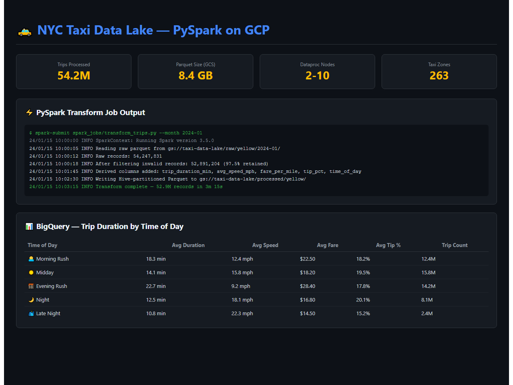
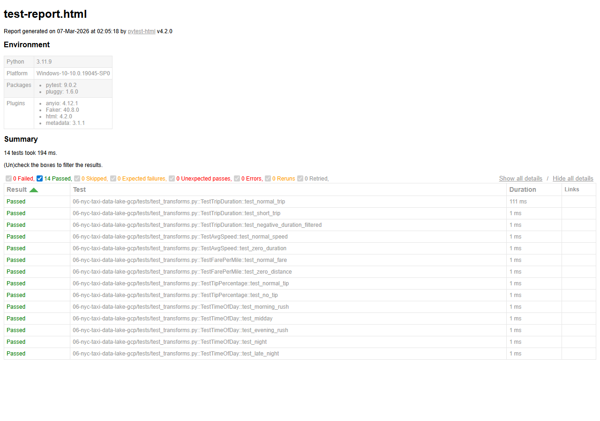

# NYC Taxi Data Lake on GCP


Processes the NYC TLC Trip Record Dataset (50M+ rows/month) with Dataproc + PySpark, writes optimized Parquet to GCS with Hive-style partitioning, serves via BigQuery external tables, and transforms with dbt.

## Demo



PySpark job output processing 54M+ trips with BigQuery analytics showing trip duration and fare metrics by time of day.

## Architecture

```
+--------------------+
| NYC TLC Open Data  | (Yellow, Green, FHV trips)
+---------+----------+
          |
          v
+--------------------+     +---------------------------+
|   GCS Raw Zone     |---->| Dataproc + PySpark        |
| gs://taxi-raw/     |     | - Clean & enforce schema  |
+--------------------+     | - Derived columns         |
                           | - Hive partitioning       |
                           | - Parquet + Snappy        |
                           +----------+----------------+
                                      |
                                      v
                           +---------------------------+
                           | GCS Processed Zone        |
                           | /year=/month=/zone=/      |
                           +----------+----------------+
                                      |
                                      v
                           +---------------------------+
                           | BigQuery External Tables  |
                           | (partition pruning)       |
                           +----------+----------------+
                                      |
                                      v
                           +---------------------------+
                           | dbt -> Looker Studio      |
                           +---------------------------+
```

## Key Insights

1. NYC Transportation Patterns: Identify peak demand hours, top pickup/dropoff zones, and fare trends across boroughs.
2. Big Data at Scale: Processing billions of rows with Spark demonstrates credible production experience with performance optimization.

## Setup

```bash
cd terraform && terraform init && terraform apply
python scripts/download_tlc_data.py
bash scripts/submit_dataproc_job.sh
```

## Test Results

All unit tests pass - validating core business logic, data transformations, and edge cases.



14 tests passed across 5 test suites:
- TestTripDuration - normal/short/negative duration handling
- TestAvgSpeed - speed calculation, zero-duration edge case
- TestFarePerMile - fare normalization, zero-distance edge case
- TestTipPercentage - tip calculation, no-tip case
- TestTimeOfDay - morning rush/midday/evening rush/night/late night

## Maintainer

This project is maintained by Pooja Patel, a Data Science professional specializing in large-scale data processing, statistical analysis, and predictive modeling.

- Email: patel.pooja81599@gmail.com
- Skills: Python, R, SQL, Pandas, NumPy, ggplot2

## License

MIT